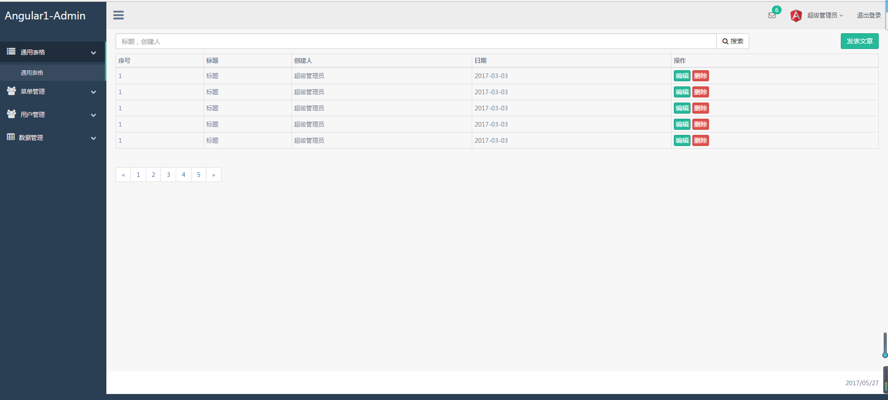
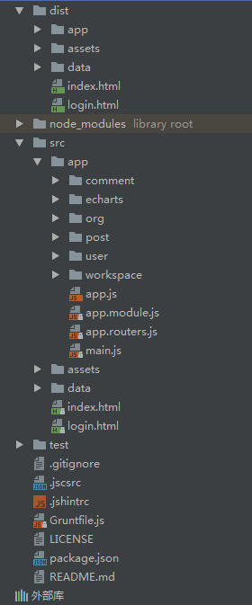

这是一个基于ng1+ui-router+RequireJS+grunt的后台管理系统模板,若果你用ng1开发,那么这份代码希望对你有帮助

技术：

Angular-1.6.4

ui-router-1.0.0-rc.1

RequireJS-2.3.3

jQuery-1.10.2

jQueryUI-1.12.1

Bootstrap-3.3.7

zTree-3.5.23

#使用方法

用git把本项目克隆到你本地，然后依次执行以下命令：

- npm install -g grunt-cli
- npm install
- grunt serve

如果你要发布项目，并对源代码进行压缩，请在项目的根目录下依次执行以下命令：

- grunt
- cd dist
- http-server

